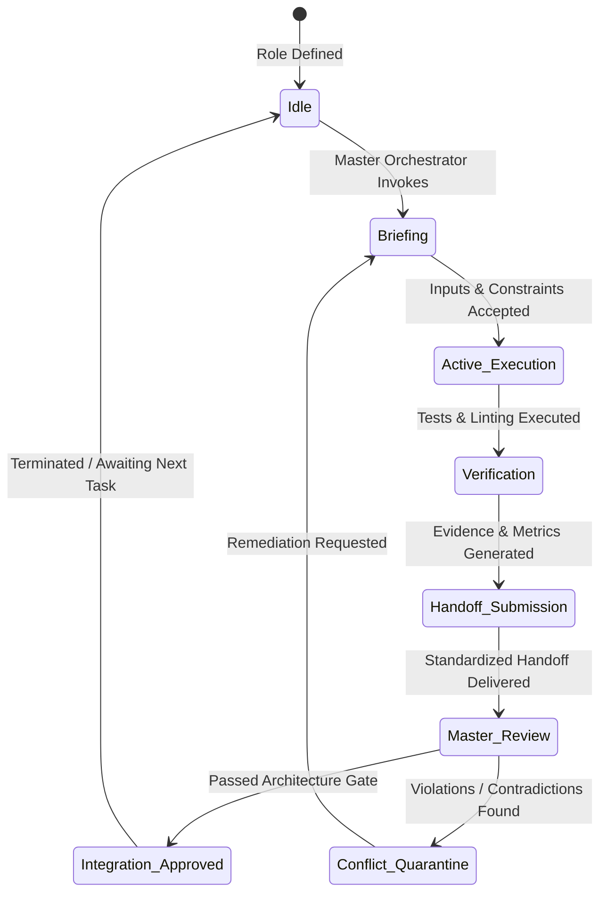

# Autonomous Agent Orchestration Architecture: PRIVATE PROTECTION

## 1. System Vision & Organizational Paradigm

The PRIVATE PROTECTION engineering lifecycle utilizes a **hierarchical autonomous agent system** orchestrated by a central **Master Orchestrator**. 

Specialist agents are **ephemeral task executors**—dynamically spawned with narrowly defined domain boundaries, explicit file ownership, and clear acceptance criteria. They terminate or idle upon task completion.

```
                        ┌──────────────────────────────┐
                        │     MASTER ORCHESTRATOR      │
                        │  (Lead Architect & Director) │
                        └──────────────┬───────────────┘
                                       │
         ┌─────────────────────────────┼─────────────────────────────┐
         │                             │                             │
┌────────▼─────────┐          ┌────────▼─────────┐          ┌────────▼─────────┐
│  FOUNDATIONAL    │          │    PLATFORM      │          │   VERIFICATION   │
│   SPECIALISTS    │          │   SPECIALISTS    │          │  & ASSURANCE     │
├──────────────────┤          ├──────────────────┤          ├──────────────────┤
│• Requirements    │          │• Mobile (iOS/And)│          │• QA & Test       │
│• System Arch     │          │• Desktop Security│          │• Performance     │
│• Cybersecurity   │          │• Browser Ext     │          │• DevSecOps       │
│• Threat Intel    │          │• Web Application │          │• Security Auditor│
│• Detection Engine│          │• Backend / API   │          │• Integration &   │
│• AI / ML         │          │• UX / Warnings   │          │  Release         │
│• Privacy         │          └──────────────────┘          └──────────────────┘
│• Data Architect  │
└──────────────────┘
```

---

## 2. Core Operational Principles

1. **Role Separation, Not Permanent Daemons**: Agents represent specialized execution roles. The Master Orchestrator activates an agent role only when an actionable task matching its mandate is queued.
2. **Strict File Ownership Boundaries**: Each specialist agent possesses write access strictly within its assigned directories. Cross-domain modifications require formal interface definitions or Master mediation.
3. **Safe Parallelism**: Independent agents with non-overlapping directory ownership and finalized interfaces execute concurrently. Dependent tasks execute strictly sequentially.
4. **Mandatory Standardized Handoff**: Every subagent completes execution by submitting a structured handoff payload. Silent completions or undocumented side effects cause immediate task rejection.
5. **Fail-Closed Architecture**: If an agent produces code or documentation that fails cryptographic, security, privacy, or architectural contracts, the Master Orchestrator rolls back the workspace and flags the conflict.

---

## 3. Dynamic Agent Lifecycle



### Stage 1: Task Briefing & Boundary Enforcement
The Master Orchestrator constructs an explicit task prompt specifying:
- Objective and scope boundaries
- Accessible input files
- Permitted target directories for modification
- Strict list of prohibited files
- Required acceptance criteria and verification tests

### Stage 2: Isolated Execution & Verification
The specialist executes strictly within its designated workspace. Before concluding, it executes all domain-specific tests (unit tests, coverage thresholds, security checks).

### Stage 3: Standard Handoff Delivery
The agent packages its results into the mandatory 11-field Handoff Schema and transmits it to the Master.

### Stage 4: Master Integration & Merge Gate
The Master Orchestrator validates that:
- No unpermitted files were modified
- All tests pass without regressions
- No architectural contracts were breached
- The workspace remains clean, buildable, and compliant

---

## 4. Agent Role Taxonomy (20 Specialized Roles)

### Group A: Foundational Architecture & Security
1. **Master Orchestrator**: Project lead, task decomposition, merge gatekeeper, architectural mediator.
2. **Requirements Architect**: Traceability, scope boundary enforcement, requirement decomposition.
3. **System Architect**: Cross-platform system design, dependency graphs, monorepo architecture.
4. **Cybersecurity Architect**: STRIDE threat modeling, attack surface minimization, tamper resistance.
5. **Threat Intelligence Specialist**: Feed ingestion, Bloom filter compilers, signature formatting.
6. **Detection Engine Specialist**: Rules, lexical analyzers, risk scoring math, core pipeline execution.
7. **AI/ML Specialist**: On-device SLM quantization, ONNX/TFLite model pipelines, prompt injection defense.
8. **Privacy Specialist**: 3-tier data classification, memory zeroing policies, OHTTP telemetry privacy.
9. **Data Architect**: Local SQLite schemas, serialization formats, state migration management.

### Group B: Platform Engineering
10. **Mobile Specialist**: Android/iOS native extensions, platform permissions, lifecycle handling.
11. **Desktop Security Specialist**: Tauri/Rust desktop client, secure IPC, download inspection.
12. **Browser Extension Specialist**: Manifest V3 Service Workers, Content Script isolation, webNavigation hooks.
13. **Web Application Specialist**: Next.js dashboard, client-side PWA WASM sandbox, web reporting.
14. **Backend / API Specialist**: Threat feed aggregation service, OTA differential update distribution.
15. **UX / Security Warning Specialist**: Warning modals, color-coded threat hierarchy, plain-language copy.

### Group C: Verification & Quality Assurance
16. **QA / Test Specialist**: Unit, integration, E2E test suites, benchmark harness maintenance.
17. **Performance Specialist**: Latency profiling, memory footprint auditing, battery impact analysis.
18. **DevSecOps Specialist**: Build reproducibility, SAST/DAST, SBOM generation, CI/CD pipelines.
19. **Security Auditor**: Adversarial fuzzing, prompt injection red-teaming, zero-trust IPC audits.
20. **Integration / Release Specialist**: Cross-platform packaging, version monotonic bump, binary signing.
