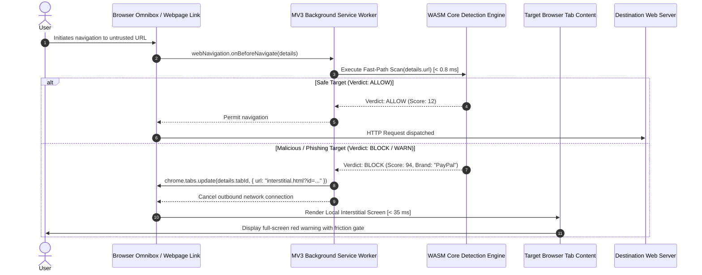

# BROWSER_TECHNICAL_ARCHITECTURE.md — WebExtension Manifest V3 Architecture & Sandboxing

> **SYSTEM STATUS: PRE-CODING GOVERNANCE PHASE ACTIVE**  
> **CANONICAL SPECIFICATION — PRIVEX BROWSER EXTENSION**  
> This document specifies the browser extension architecture under Manifest V3 (MV3), covering background service worker lifecycles, WebAssembly integration, pre-navigation interception, isolated Shadow DOM overlays, and browser sandbox constraints.

---

## 1. MANIFEST V3 COMPONENT TOPOLOGY

```
┌────────────────────────────────────────────────────────────────────────────────────────────────────────┐
│ BROWSER EXTENSION (MANIFEST V3 RUNTIME)                                                                │
│                                                                                                        │
│   ┌────────────────────────────────────────────────────────────────────────────────────────────────┐   │
│   │ BACKGROUND SERVICE WORKER (Ephemeral • Terminates after 30s inactivity)                        │   │
│   │                                                                                                │   │
│   │   ┌──────────────────────────────┐     ┌───────────────────────────────────────────────────┐   │   │
│   │   │ webNavigation.onBeforeNav    │────►│ Compiled WebAssembly Core Engine                  │   │   │
│   │   │ declarativeNetRequest rules  │     │ • Punycode & Canonical Normalizer (< 0.2 ms)      │   │   │
│   │   └──────────────────────────────┘     │ • In-Memory Bloom Filter Lookup (< 0.05 ms)       │   │   │
│   │                                        │ • Lexical & Brand Spoof Evaluator (< 0.5 ms)      │   │   │
│   │   ┌──────────────────────────────┐     │ • Multi-Factor Risk Scorer (< 0.1 ms)             │   │   │
│   │   │ IndexedDB State Hydration    │◄────┤ TOTAL FAST-PATH LATENCY: < 0.85 ms                │   │   │
│   │   │ (AES-GCM Web Crypto Session) │     └─────────────────────────┬─────────────────────────┘   │   │
│   │   └──────────────────────────────┘                               │                             │   │
│   └──────────────────────────────────────────────────────────────────┼─────────────────────────────┘   │
│                                                                      │                                 │
│                   PostMessage / chrome.tabs.sendMessage              │ (If Verdict == WARN / BLOCK)    │
│                                                                      ▼                                 │
│   ┌────────────────────────────────────────────────────────────────────────────────────────────────┐   │
│   │ CONTENT SCRIPT (Isolated World Sandbox • Shadow DOM Container)                                 │   │
│   │ • Injected into target tab before page renders                                                 │   │
│   │ • Closes `mode: "closed"` Shadow Root (Host page JS/CSS cannot inspect or manipulate warning)  │   │
│   │ • Displays Red Warning Shield + Friction Countdown Timer                                       │   │
│   │ • Inspects DOM for insecure password inputs (<form action="http://...">)                       │   │
│   └────────────────────────────────────────────────────────────────────────────────────────────────┘   │
│                                                                                                        │
│   ┌──────────────────────────────────────────────┐     ┌───────────────────────────────────────────┐   │
│   │ EXTENSION POPUP UI (Action Button)           │     │ EXTENSION OPTIONS / SETTINGS (Dashboard)  │   │
│   │ • Instant site safety status report          │     │ • Manage custom domain allowlists         │   │
│   │ • Manual URL scanner form                    │     │ • Toggle detection sensitivity            │   │
│   │ • Quick Allowlist override button            │     │ • Local event audit history viewer        │   │
│   └──────────────────────────────────────────────┘     └───────────────────────────────────────────┘   │
└────────────────────────────────────────────────────────────────────────────────────────────────────────┘
```

---

## 2. BACKGROUND SERVICE WORKER LIFECYCLE & EPHEMERALITY

Manifest V3 replaces persistent background pages with ephemeral Service Workers that terminate after 30 seconds of inactivity. To guarantee sub-millisecond detection without cold-start penalties:

1. **Fast-State Rehydration Strategy**:
   - The compiled WebAssembly module is cached in the browser's Bytecode Cache.
   - The binary Bloom filter is loaded into an `ArrayBuffer` in memory upon worker wake.
   - Rehydration from `chrome.storage.session` or IndexedDB takes $< 8\text{ ms}$.
2. **Zero In-Memory Session Loss**:
   - Security state is persisted to `chrome.storage.session` (in-memory, cleared on browser exit).
   - If the worker is terminated between tab navigations, the wake-up hook reconstitutes the session before processing navigation events.

---

## 3. PRE-NAVIGATION INTERCEPTION & WARNING WORKFLOW



---

## 4. TAMPER-PROOF SHADOW DOM WARNING OVERLAY

When displaying in-page warnings (e.g. for suspicious iframe overlays or insecure password forms on otherwise benign sites):
1. **Closed Shadow Root**: Injected into the document root via `element.attachShadow({ mode: 'closed' })`. The host page JavaScript cannot access `shadowRoot` or query inner warning DOM elements.
2. **CSS Isolation**: All warning styles use CSS reset wrappers and strict `!important` declarations, preventing hostile website stylesheets from hiding or obscuring the security banner.
3. **Event Hijacking Defense**: Click handlers for "Go Back to Safety" and "Proceed (Unsafe)" run in the extension's Isolated World, immune to `stopPropagation()` or `preventDefault()` from the host page.

---

## 5. PASSWORD INPUT SHIELDING & DOM INSPECTION

1. **Detection Heuristic**:
   - Content scripts scan for `input[type="password"]`.
   - If found, checks parent `<form>` action:
     - Is the form action using an unencrypted `http://` protocol?
     - Does the form action post credentials to a cross-origin third-party domain?
2. **Privacy Boundary**:
   - The extension **NEVER INSPECTS KEYSTROKES OR INPUT VALUES**.
   - Inspection is strictly structural: `input.type`, `form.action`, `form.method`. Keystroke events are completely ignored.

---

## 6. PERMISSIONS MODEL & MINIMAL PRIVILEGE

The extension requests only strictly justified permissions in `manifest.json`:
- `"webNavigation"`: Required to intercept pre-navigation URLs before network dispatch.
- `"declarativeNetRequest"`: High-performance declarative network blocking.
- `"storage"`: Encrypted local caching of allowlists and settings.
- `"activeTab"`: Temporary access to current tab for user-initiated manual scanning.

### Prohibited Permissions
- ❌ `"cookies"`: Prohibited; extension does not inspect user session cookies.
- ❌ `"webRequestBlocking"`: Deprecated in MV3; replaced by `declarativeNetRequest`.
- ❌ `"<all_urls>"` (in host permissions without activeTab): Minimized to specific active interaction where feasible.

---

## 7. BROWSER SANDBOX LIMITATIONS & HONESTY STATEMENT

1. **No Operating System Antivirus Capabilities**: The extension cannot scan files on the host computer's hard drive outside of downloaded files explicitly intercepted via browser APIs.
2. **No Background Mobile SMS Access**: The extension cannot read SMS or messaging apps; protection is strictly limited to browser navigation.
3. **No Dynamic Code Loading**: MV3 prohibits `eval()`, `new Function()`, and loading external scripts. 100% of detection rules and WASM code are bundled locally inside the extension archive.
