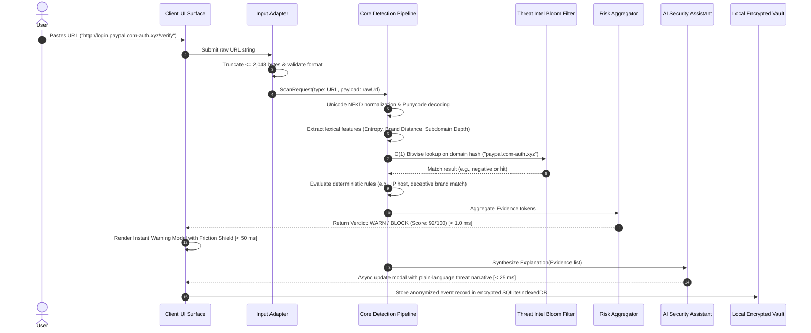
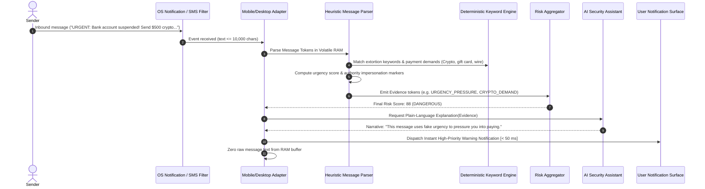
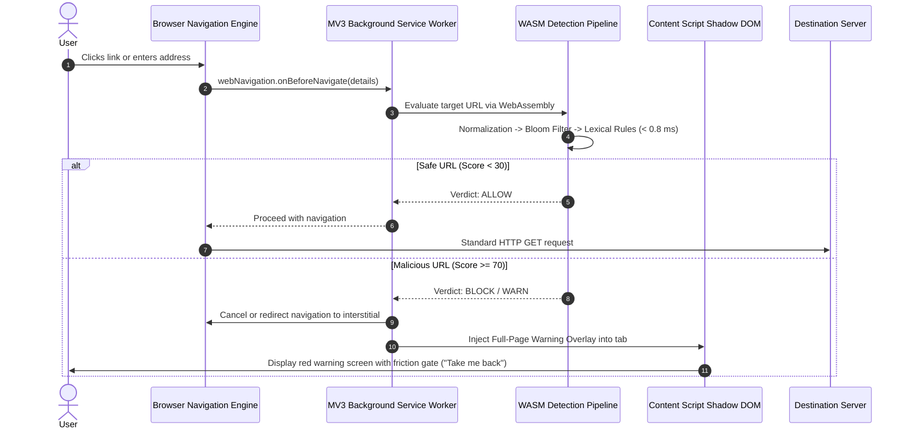
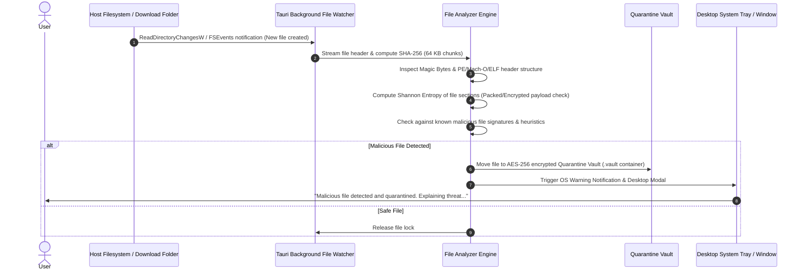
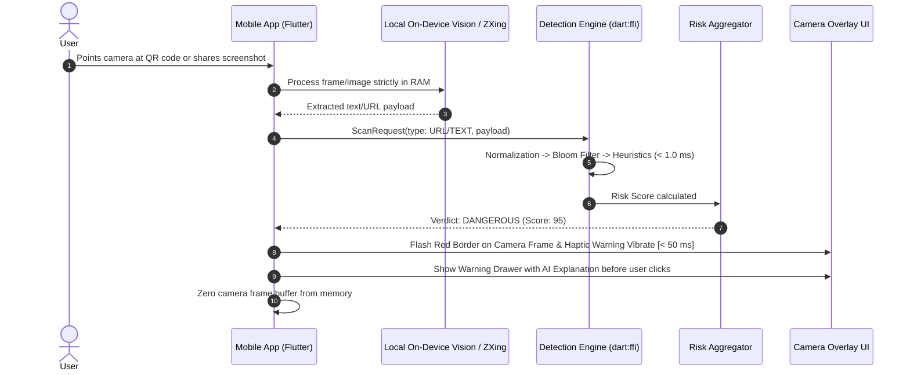
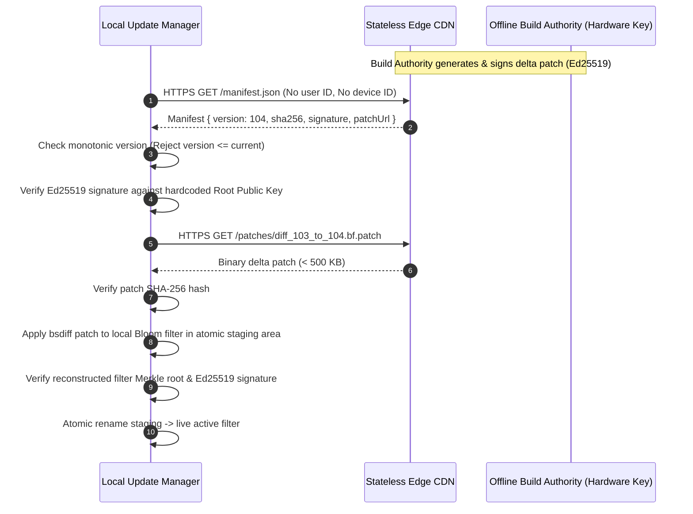
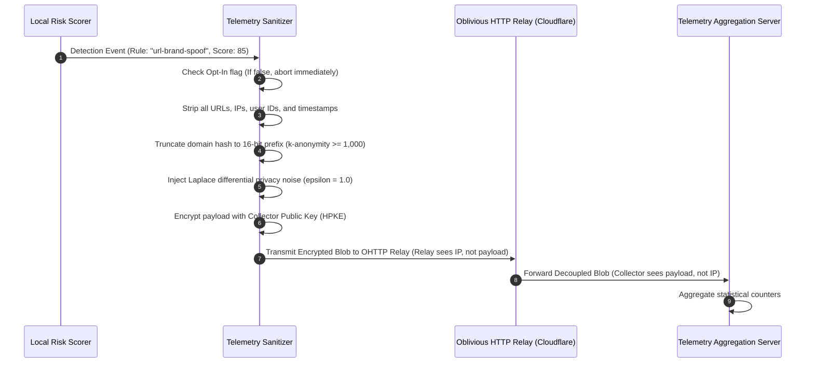

# DATA_FLOW_ARCHITECTURE.md — Comprehensive Data Flows & Processing Pipelines

> **SYSTEM STATUS: PRE-CODING GOVERNANCE PHASE ACTIVE**  
> **CANONICAL SPECIFICATION — PRIVEX DATA FLOWS**  
> This document specifies the exact, step-by-step data flows across all eight primary operations in the PRIVEX ecosystem. Each flow documents input, normalization, processing stages, detectors, AI involvement, threat intelligence, risk aggregation, output, storage, network transmission, and privacy boundaries.

---

## 1. FLOW TAXONOMY & OVERVIEW

```
┌──────────────────────────────────────────────────────────────────────────────────────────────┐
│                                    DATA FLOW DIRECTORY                                       │
│                                                                                              │
│   FLOW A: Manual User URL Check (Web / Extension / Desktop / Mobile Form)                    │
│   FLOW B: Inbound Scam Message Analysis (SMS / Chat / Email / Clipboard)                     │
│   FLOW C: Real-Time Browser Pre-Navigation Intercept (Extension WebNavigation)               │
│   FLOW D: Local Desktop Download / File Inspection (Tauri Filesystem Watcher)                │
│   FLOW E: Mobile Screenshot / Live Camera QR Code Scan (Flutter Camera / Gallery Share)      │
│   FLOW F: Air-Gapped Offline Threat Detection (100% Disconnected Core Pipeline)              │
│   FLOW G: Differential Threat Intelligence & OTA Update Ingestion                            │
│   FLOW H: Privacy-Preserving Cloud Telemetry Relay (Opt-In OHTTP Telemetry)                  │
└──────────────────────────────────────────────────────────────────────────────────────────────┘
```

---

## 2. DETAILED FLOW SPECIFICATIONS

---

### FLOW A: Manual Suspicious URL Analysis
*User submits a suspicious URL via manual input field in Web App, Mobile App, or Desktop UI.*



- **Input**: Raw URL string from user clipboard or text field (max 2,048 bytes).
- **Normalization**: Unicode NFKD canonicalization; lowercase scheme and host; Punycode homoglyph resolution (`pаypal` Cyrillic `а` resolved to `a`); path stripping for domain checks.
- **Processing**: Extraction of lexical metrics (Shannon entropy, Levenshtein edit distance against 100 top protected brands, subdomain count, suspicious TLD flag).
- **Detectors**: `DeterministicRuleEngine` + `LexicalAnalyzer` + `PunycodeAnalyzer`.
- **AI Involvement**: **Read-Only Narrative Synthesis**. The AI engine receives the structured `Evidence` list (e.g., `["BRAND_SPOOF_PAYPAL", "SUSPICIOUS_TLD_XYZ", "HIGH_ENTROPY"]`) and generates the user explanation.
- **Threat Intelligence**: Local memory-mapped binary Bloom filter lookup ($O(1)$) on host hash prefix.
- **Risk Aggregation**: Multi-factor non-linear Bayesian scorer yields Score: 92, Confidence: 0.95, Action: `BLOCK`.
- **Output**: Warning modal rendered in $< 50\text{ ms}$; detailed explanation rendered in $< 25\text{ ms}$.
- **Storage**: Event metadata (timestamp, rule IDs, risk score) persisted to SQLCipher/IndexedDB. Raw URL is **not** persisted unless user explicitly whitelists it.
- **Network Transmission**: **ZERO**. Entire execution occurs in local volatile RAM.
- **Privacy Boundary**: Tier 1 data processed strictly inside local process memory.

---

### FLOW B: Inbound Scam Message Analysis
*Inbound SMS, chat message, or email text is analyzed for social engineering, urgency extortion, or financial scam indicators.*



- **Input**: Raw text message string (max 10,000 characters).
- **Normalization**: Unicode NFKD normalization; leetspeak and zero-width character de-obfuscation; regex-based tokenization into sentences and entities.
- **Processing**: Extraction of urgency markers (time pressure indicators), financial demands (cryptocurrency wallet regexes, wire transfers, gift cards), and authority impersonation cues (IRS, Bank, Police).
- **Detectors**: `MessageAnalyzer` + `UrgencyHeuristicEngine` + `FinancialExtortionDetector`.
- **AI Involvement**: Translates matched scam patterns into cognitive Grade 6 explanations explaining *why* the message is fraudulent and instructing the user *never* to reply or click links.
- **Threat Intelligence**: Checks extracted URLs/cryptocurrency addresses against local blocklist caches.
- **Risk Aggregation**: Weighted multi-factor aggregation computes overall scam probability score (0-100).
- **Output**: High-priority push notification / warning banner with clear "Do Not Reply" recommendation.
- **Storage**: Zero-knowledge logging: increments local scam category counter; raw message text is zeroed from RAM immediately upon scan completion.
- **Network Transmission**: **ZERO**. 100% on-device processing.
- **Privacy Boundary**: Tier 1 raw message content strictly isolated to volatile memory.

---

### FLOW C: Real-Time Browser Pre-Navigation Intercept
*User clicks a link or enters a URL in the browser address bar. The browser extension intercepts navigation before network transmission.*



- **Input**: Navigation URL intercepted via `webNavigation.onBeforeNavigate` or `declarativeNetRequest`.
- **Normalization**: Canonical normalization and Punycode resolution via compiled WebAssembly module.
- **Processing**: High-speed pre-flight check in background Service Worker.
- **Detectors**: `WASMBloomFilter` + `WASMLexicalAnalyzer`.
- **AI Involvement**: Deterministic templates provide instant headline; local ONNX-Web/Template generates full breakdown on warning overlay.
- **Threat Intelligence**: In-memory Bloom filter lookup completed in $< 0.05\text{ ms}$.
- **Risk Aggregation**: Immediate threshold evaluation against pre-set security policies.
- **Output**: Navigation cancellation and injection of un-bypassable Shadow DOM interstitial warning.
- **Storage**: Temporary session cache of blocked domain in `chrome.storage.local`.
- **Network Transmission**: **ZERO outbound calls** prior to user decision. If blocked, zero network packets reach the destination server.
- **Privacy Boundary**: Full browsing history never leaves the local browser extension sandbox.

---

### FLOW D: Desktop Local File & Download Inspection
*User downloads a file or requests a scan of a local executable/document.*



- **Input**: Local file path or streamed byte chunks from download directory watcher.
- **Normalization**: Path sanitization, symlink resolution, magic byte header identification.
- **Processing**: Extraction of file metadata, magic bytes vs. file extension consistency, Shannon entropy across sections, and PE/Mach-O header anomaly parsing.
- **Detectors**: `FileHeaderAnalyzer` + `EntropyCalculator` + `SignatureMatchEngine`.
- **AI Involvement**: Synthesizes explanation of executable anomalies (e.g., "This file pretends to be a PDF but is actually an executable with suspicious packed code").
- **Threat Intelligence**: Hash prefix comparison against local threat intelligence database.
- **Risk Aggregation**: Evaluates structural indicators into aggregate risk score.
- **Output**: System tray alert, window popup, and atomic file move into local encrypted quarantine vault.
- **Storage**: Quarantine metadata saved in encrypted SQLite. File contents encrypted with AES-256-GCM.
- **Network Transmission**: **ZERO**. Pure offline desktop processing.
- **Privacy Boundary**: File bytes and file paths remain strictly on the local machine.

---

### FLOW E: Mobile Screenshot & Live Camera QR Code Scan
*User scans a QR code with the device camera or shares a screenshot to PRIVEX.*



- **Input**: Camera bitmap buffer or shared screenshot image from gallery.
- **Normalization**: On-device barcode/QR decoding (ZXing / Google ML Kit local barcode API) or on-device OCR.
- **Processing**: Decoded string payload passed directly into `@private-protection/core`.
- **Detectors**: Vision decoder + full URL/Message detection pipeline.
- **AI Involvement**: Read-only explanation of detected QR payload deception.
- **Threat Intelligence**: In-memory Bloom filter query.
- **Risk Aggregation**: Standard core risk scoring.
- **Output**: Real-time camera viewfinder bounding box colored red, haptic vibration feedback, and warning modal.
- **Storage**: Zero persistence of camera frames or image pixels.
- **Network Transmission**: **ZERO**.
- **Privacy Boundary**: Raw visual frames processed entirely in ephemeral GPU/CPU memory and immediately released.

---

### FLOW F: Air-Gapped Offline Threat Detection
*Device is in Airplane Mode or operating within a physically air-gapped secure environment.*

- **Input**: Any supported payload (URL, text, file, QR).
- **Processing**: 100% identical to normal operation. All rules, lexical models, heuristics, Bloom filters, and explanation templates are hosted locally on disk and loaded in RAM.
- **Threat Intelligence**: Uses cached local Bloom filter with staleness indicator. If cache is $> 30\text{ days}$ old, system applies a mild conservative penalty to borderline scores while maintaining full deterministic and heuristic protection.
- **AI Involvement**: Deterministic parameterized template engine or local quantized ONNX model executes with zero cloud dependency.
- **Network Transmission**: **ABSOLUTELY ZERO**. Network sockets are never opened.
- **Privacy Boundary**: Physically and logically contained within the device endpoint.

---

### FLOW G: Differential Threat Intelligence & OTA Update
*Background daemon queries the static update CDN for signed delta patches.*



- **Input**: Outbound HTTP GET request to CDN for public update manifest.
- **Normalization**: Cryptographic verification of update manifest and delta binary.
- **Security Check**: Verification of monotonic version counter (anti-downgrade) and Ed25519 cryptographic signature.
- **Storage**: Atomic write to temporary staging directory followed by atomic file swap.
- **Network Transmission**: Standard HTTPS GET for static binary blobs. **Zero user payload transmitted**.
- **Privacy Boundary**: Request contains only standard HTTP cache headers; zero tracking cookies, user IDs, or device identifiers.

---

### FLOW H: Privacy-Preserving Cloud Telemetry Relay (Opt-In Only)
*User has explicitly opted into anonymous threat telemetry to help improve global detection feeds.*



- **Input**: Detection event telemetry struct.
- **Sanitization & Differential Privacy**: Complete removal of Tier 1 user data; truncation of domain hashes to 16-bit prefixes ensuring $k\ge 1,000$; addition of Laplace differential privacy noise ($\varepsilon = 1.0$).
- **Cryptographic Oblivious Relay**: Hybrid Public Key Encryption (HPKE RFC 9180) payload transmitted via Oblivious HTTP (RFC 9458) relay.
- **Network Transmission**: Relay sees Client IP but cannot decrypt payload; Collector receives decrypted payload but has zero visibility into Client IP.
- **Privacy Boundary**: Mathematically prevents re-identification and tracking of individual users.
