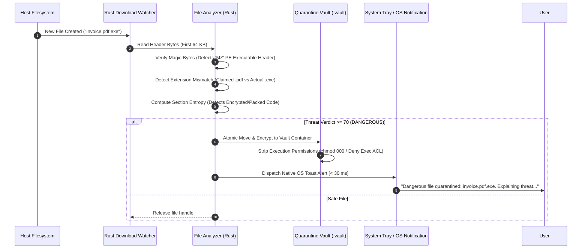

# DESKTOP_TECHNICAL_ARCHITECTURE.md — Tauri 2.x Desktop Security Client & Quarantine Vault

> **SYSTEM STATUS: PRE-CODING GOVERNANCE PHASE ACTIVE**  
> **CANONICAL SPECIFICATION — PRIVATE PROTECTION DESKTOP CLIENT**  
> This document specifies the desktop security client architecture across Windows and macOS, detailing the Tauri 2.x framework, memory-safe Rust backend daemon, filesystem download monitoring, encrypted quarantine vault, and explicit user-mode boundary constraints.

---

## 1. DESKTOP SYSTEM TOPOLOGY & COMPONENT LAYERING

```
┌────────────────────────────────────────────────────────────────────────────────────────────────────────┐
│ TAURI 2.x DESKTOP CLIENT (UNPRIVILEGED USER-SPACE EXECUTION)                                           │
│                                                                                                        │
│   ┌────────────────────────────────────────────────────────────────────────────────────────────────┐   │
│   │ WEBVIEW PRESENTATION LAYER (Solid.js / TypeScript • Native OS Webview2 / WebKit)               │   │
│   │ • Lightweight UI (Idle RSS < 35 MB) • Instant Startup (< 150 ms)                                │   │
│   │ • System Tray Menu (Quick Status, Pause Monitoring, Open Vault)                                │   │
│   │ • Drag-and-Drop File Scanning Zone & Real-Time Threat Visualization                            │   │
│   └────────────────────────────────────────┬───────────────────────────────────────────────────────┘   │
│                                            │                                                           │
│                                            ▼ Tauri IPC Boundary (Strict JSON Commands & Events)         │
│   ┌────────────────────────────────────────────────────────────────────────────────────────────────┐   │
│   │ RUST CORE SECURITY DAEMON (Native Multi-Threaded Toko Runtime)                                 │   │
│   │                                                                                                │   │
│   │   ┌──────────────────────────────┐     ┌───────────────────────────────────────────────────┐   │   │
│   │   │ Filesystem Download Watcher  │────►│ File Header & Entropy Analyzer (Tokio / Rayon)     │   │   │
│   │   │ • Windows: ReadDirectoryChangesW   │ • Magic bytes vs extension verification           │   │   │
│   │   │ • macOS: FSEvents / kqueue   │     │ • Shannon entropy across PE/Mach-O sections       │   │   │
│   │   └──────────────────────────────┘     │ • Embedded WASM / C-ABI Detection Engine          │   │   │
│   │                                        └─────────────────────────┬─────────────────────────┘   │   │
│   │   ┌──────────────────────────────┐                               │                             │   │
│   │   │ Encrypted Quarantine Vault   │◄──────────────────────────────┘ (If Threat Detected)        │   │
│   │   │ • AES-256-GCM File Container │                                                             │   │
│   │   │ • Execution ACL Stripped     │                                                             │   │
│   │   └──────────────────────────────┘                                                             │   │
│   └────────────────────────────────────────────────────────────────────────────────────────────────┘   │
└────────────────────────────────────────────────────────────────────────────────────────────────────────┘
```

---

## 2. BACKGROUND DOWNLOAD FOLDER MONITORING

1. **OS-Native Filesystem Hooks**:
   - **Windows**: Implemented using `ReadDirectoryChangesW` wrapped in an async Tokio thread pool.
   - **macOS**: Implemented using the `FSEvents` API.
   - **Monitored Targets**: Standard user `Downloads` directory and browser download paths.
2. **Safe Ingestion Protocol**:
   - When a `FILE_ACTION_ADDED` or `FILE_ACTION_MODIFIED` event is received:
   - The daemon checks if the file is still being written by checking for active write locks (e.g. `.crdownload` or `.part` extensions).
   - Once file writing completes, the daemon reads the first **64 KB header chunk** in memory.
   - The daemon **NEVER EXECUTES OR LOADS** the target file into host process space.

---

## 3. FILE ANALYSIS & HEURISTICS



---

## 4. ENCRYPTED QUARANTINE VAULT ARCHITECTURE

When a file is flagged as malicious, it is immediately neutralized:
1. **Atomic File Isolation**:
   - The file is atomically moved from the user directory into the app's protected `.vault/` directory.
2. **Permission Stripping**:
   - **Windows**: Updates NTFS Access Control List (DACL) to deny `GENERIC_EXECUTE` to all users.
   - **macOS**: Sets file permissions to `000` (`chmod 0000`).
3. **AES-256-GCM Vault Encryption**:
   - The file contents are encrypted with an ephemeral 256-bit AES key derived from the OS Keystore.
   - File extension is rewritten to `.quarantine_blob` with a randomized UUID filename to prevent accidental user double-clicking.
4. **Vault Management Workflows**:
   - *Restore*: User can review the technical explanation and explicitly restore the file to an isolated folder if identified as a false positive.
   - *Permanent Delete*: Securely overwrites the file bytes with cryptographic pseudo-random noise before unlinking.

---

## 5. PRIVILEGE BOUNDARY & ARCHITECTURAL HONESTY

> **CONSTITUTIONAL DIRECTIVE**: PRIVATE PROTECTION Desktop Software will **NEVER** claim to be a kernel-level Antivirus or Endpoint Detection & Response (EDR) system.

1. **User-Space Only**: The software executes strictly with standard user privileges. It does not install kernel-mode drivers (`.sys` on Windows or Kernel Extensions on macOS).
2. **Scope of Protection**: Protection is focused on **ingress points** (browser downloads, user-initiated file scans, drag-and-drop analysis) and **communication vectors** (URLs, messages, clipboard text). It does not intercept kernel-level process injection or rootkit memory modifications.
3. **No System Slowdown**: By restricting background scanning strictly to the Downloads folder and newly created ingress files, idle CPU usage remains at $0.0\%$ with memory footprint $< 35\text{ MB}$.
