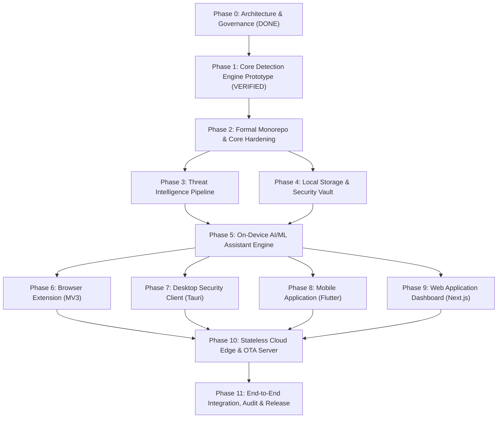

# IMPLEMENTATION_DEPENDENCY_GRAPH.md — Dependency DAG, Agent Ownership & Exit Criteria

> **SYSTEM STATUS: PRE-CODING GOVERNANCE PHASE ACTIVE**  
> **CANONICAL SPECIFICATION — PRIVATE PROTECTION IMPLEMENTATION DEPENDENCY GRAPH**  
> This document specifies the precise, phase-by-phase directed acyclic graph (DAG) governing all future implementation work. No phase may begin until all prerequisite phases have satisfied their exit criteria.

---

## 1. HIGH-LEVEL PHASE DEPENDENCY DIRECTED ACYCLIC GRAPH (DAG)

---

## 2. DETAILED PHASE SPECIFICATIONS (PHASE 0 THROUGH PHASE 11)

---

### Phase 0: Architecture, Constitution & Governance
- **Status**: **COMPLETE & VERIFIED**.
- **Prerequisites**: Problem statement PS-05.
- **Responsible Subagents**: `master_orchestrator`, `requirements_architect`, `engineering_architect`.
- **Files Owned**: `AGENTS.md`, `docs/*`.
- **Exit Criteria**: All 15 pre-coding gates satisfied with concrete architectural documentation.

---

### Phase 1: Core Detection Engine Prototype Verification
- **Status**: **COMPLETE & VERIFIED**.
- **Prerequisites**: Phase 0.
- **Responsible Subagents**: `core_engine_developer`, `qa_automation_specialist`.
- **Files Owned**: `packages/core/src/*`, `packages/core/tests/*`.
- **Verification Evidence**: 69/69 tests passed, 97.49% statement coverage, 100-sample benchmark 100% accuracy, 0.72ms p95 latency.

---

### Phase 2: Formal Monorepo Workspace & Core Engine Hardening
- **Prerequisites**: Phase 1 verified.
- **Responsible Subagents**: `monorepo_setup_engineer`, `core_engine_developer`, `security_detection_architect`.
- **Files Owned**: `turbo.json`, `package.json`, `tsconfig.base.json`, `packages/core/*`.
- **Contracts Consumed**: `ScanRequest`, `ScanResult`, `AnalysisContext`.
- **Contracts Produced**: `@private-protection/core` NPM package, C-ABI bindings, WebAssembly compiled binary.
- **Tests Required**: Tier 1 (Unit), Tier 3 (Contracts), Tier 6 (Fuzzing).
- **Security Review**: Zero-allocation hot path verification; ReDoS fuzzing.
- **Exit Criteria**: Monorepo builds cleanly; core compiles to TypeScript and WebAssembly; 100% unit tests pass; >90% coverage.

---

### Phase 3: Threat Intelligence Pipeline & Bloom Filter Engine
- **Prerequisites**: Phase 2.
- **Responsible Subagents**: `threat_intel_engineer`, `security_detection_architect`.
- **Files Owned**: `packages/threat-intel/*`, `threat-data/*`.
- **Contracts Consumed**: `ThreatIntelRecord`, `UpdateMetadata`.
- **Contracts Produced**: `ThreatIntelligenceProvider` implementation, binary Bloom filter compiler (`.bf`).
- **Tests Required**: Tier 1 (Unit), Tier 7 (Benchmark: < 0.05ms lookup), False Positive Rate validation (< 0.1%).
- **Security Review**: Verification of cryptographic hashing algorithms (Murmur3 / XXHash3).
- **Exit Criteria**: Threat compiler produces < 3.5 MB binary filter for 1,000,000 domains; O(1) in-memory lookup verified.

---

### Phase 4: Encrypted Local Storage & Quarantine Vault
- **Prerequisites**: Phase 2.
- **Responsible Subagents**: `privacy_security_architect`, `engineering_architect`.
- **Files Owned**: `packages/storage/*`.
- **Contracts Consumed**: `LocalStorage`, `SecurityEvent`, `custom_allowlist`.
- **Contracts Produced**: Encrypted SQLite (SQLCipher) driver, Web Crypto IndexedDB driver.
- **Tests Required**: Tier 1 (Unit), Tier 4 (Keystore derivation), Tier 5 (Offline storage), Crypto-shredding test.
- **Security Review**: Verification of Argon2id parameters, AES-256-GCM page encryption, and zero Tier 1 payload persistence.
- **Exit Criteria**: Database operates transparently encrypted; crypto-shredding wipes keys; zero unencrypted leaks to disk.

---

### Phase 5: On-Device AI / ML Assistant & Explanation Synthesizer
- **Prerequisites**: Phase 2, Phase 3, Phase 4.
- **Responsible Subagents**: `aiml_engineer`, `ux_performance_architect`, `security_detection_architect`.
- **Files Owned**: `packages/ai-assistant/*`, `packages/ai-assistant/models/*`.
- **Contracts Consumed**: `AssistantInput`, `AssistantOutput`, `ExplanationEngine`, `SecurityAssistant`.
- **Contracts Produced**: ONNX INT8 runtime wrapper, Deterministic Template Engine fallback.
- **Tests Required**: Tier 1 (Unit), Tier 8 (Reading grade <= Grade 8), Tier 9 (Adversarial prompt injection bypass = 0.0%).
- **Security Review**: Indirect prompt injection isolation audit; grammar-based JSON decoding verification.
- **Exit Criteria**: Explanations generated in < 25ms; template fallback operational in < 0.1ms; 0% prompt injection escapes.

---

### Phase 6: Browser Extension (Manifest V3)
- **Prerequisites**: Phase 5.
- **Responsible Subagents**: `browser_extension_specialist`, `frontend_architect`.
- **Files Owned**: `apps/browser/*`.
- **Contracts Consumed**: `@private-protection/core` (WASM), `AssistantOutput`, `DOMSnapshot`.
- **Contracts Produced**: Chrome MV3 zip, Firefox MV3 zip.
- **Tests Required**: Tier 4 (Playwright MV3 extension), Tier 10 (Pre-navigation intercept Flow C).
- **Security Review**: Manifest V3 CSP review, Shadow DOM closed root isolation.
- **Exit Criteria**: Extension intercepts navigation in < 0.85ms; warning overlay renders in < 50ms; zero browsing history transmitted.

---

### Phase 7: Desktop Security Client (Tauri 2.x)
- **Prerequisites**: Phase 5.
- **Responsible Subagents**: `desktop_software_specialist`, `engineering_architect`.
- **Files Owned**: `apps/desktop/*`.
- **Contracts Consumed**: `@private-protection/core` (C-ABI/Rust), `FileAnalyzer`, `quarantine_records`.
- **Contracts Produced**: Windows `.msi` installer, macOS `.dmg` installer.
- **Tests Required**: Tier 4 (Tauri IPC), Tier 10 (Download monitoring Flow D), Quarantine isolation test.
- **Security Review**: Unprivileged user execution review; NTFS/macOS permission stripping.
- **Exit Criteria**: Desktop client monitors downloads folder with 0% idle CPU; quarantines malicious files in < 30ms; idle RSS < 35 MB.

---

### Phase 8: Mobile Application (Flutter & Native Channels)
- **Prerequisites**: Phase 5.
- **Responsible Subagents**: `mobile_platform_specialist`, `frontend_architect`.
- **Files Owned**: `apps/mobile/*`.
- **Contracts Consumed**: `@private-protection/core` (dart:ffi), `NotificationService`, `AnalysisContext`.
- **Contracts Produced**: Android `.aab`, iOS `.ipa`.
- **Tests Required**: Tier 4 (Robolectric / XCTest), Tier 10 (QR camera HUD Flow E, SMS filter Flow B).
- **Security Review**: Android NotificationListener RAM zeroing audit; iOS IdentityLookup sandbox audit.
- **Exit Criteria**: Android notification filter processes SMS in volatile RAM; live camera QR HUD highlights red in < 50ms; 0% background battery drain.

---

### Phase 9: Web Application Dashboard (Next.js Static PWA)
- **Prerequisites**: Phase 5.
- **Responsible Subagents**: `web_frontend_developer`, `frontend_architect`.
- **Files Owned**: `apps/web/*`.
- **Contracts Consumed**: `@private-protection/core` (WASM), Web Worker message channel.
- **Contracts Produced**: Static export directory (`out/`), PWA Service Worker.
- **Tests Required**: Tier 4 (Browser compatibility), Tier 5 (PWA offline functionality), Tier 10 (Flow A).
- **Security Review**: Strict Content Security Policy audit; zero outbound API calls verified.
- **Exit Criteria**: Static PWA loads in < 500ms; executes 100% in browser thread; functions completely offline.

---

### Phase 10: Stateless Cloud Edge & OTA Update Server
- **Prerequisites**: Phase 6, Phase 7, Phase 8, Phase 9.
- **Responsible Subagents**: `backend_cloud_engineer`, `privacy_security_architect`.
- **Files Owned**: `services/edge-cdn/*`, `services/ohttp-relay/*`.
- **Contracts Consumed**: `UpdateManifest`, `BackendClient`.
- **Contracts Produced**: Stateless Cloudflare Worker / Fastly Compute scripts, OHTTP relay endpoint.
- **Tests Required**: Tier 3 (OHTTP encapsulation), Tier 6 (DDoS & rate limit testing), Privacy audit.
- **Security Review**: Verification that backend contains zero user databases and logs zero client IPs with payloads.
- **Exit Criteria**: Update CDN serves signed Bloom filter diffs in < 50ms; OHTTP relay decouples IP from telemetry.

---

### Phase 11: Monorepo End-to-End Integration, Audit & Release
- **Prerequisites**: Phases 0 through 10.
- **Responsible Subagents**: `integration_release_specialist`, `master_orchestrator`, `compliance_audit_specialist`.
- **Files Owned**: Monorepo root, `.github/workflows/*`, release tags.
- **Contracts Consumed**: All 18 subsystem contracts.
- **Tests Required**: Complete 11-Tier test suite execution across all target platforms.
- **Security Review**: Comprehensive STRIDE threat audit, third-party penetration testing, SLSA Level 3 SBOM generation.
- **Exit Criteria**: 100% test pass rate across all suites; code coverage > 90%; zero high/critical vulnerabilities; official code signing and release packaging complete.

---

## 3. STRICT NON-PARALLELISM & DEPENDENCY RULES

1. **No Application Coding Prior to Phase 5**:
   - Neither the Web App, Browser Extension, Desktop Software, nor Mobile App may be implemented until the Shared Core (Phase 2), Threat Intel (Phase 3), Storage (Phase 4), and AI Assistant (Phase 5) are complete and tested.
2. **Strict File Ownership**:
   - Each specialist subagent is strictly prohibited from modifying files outside their registered directory ownership (as defined in `docs/AGENT_FILE_OWNERSHIP.md`).
3. **No Uncoordinated Schema Edits**:
   - Any modification to domain models or contracts requires explicit Master Orchestrator approval and updates to `docs/DOMAIN_MODELS.md` and `docs/INTERFACE_CONTRACTS.md` before code changes commence.
