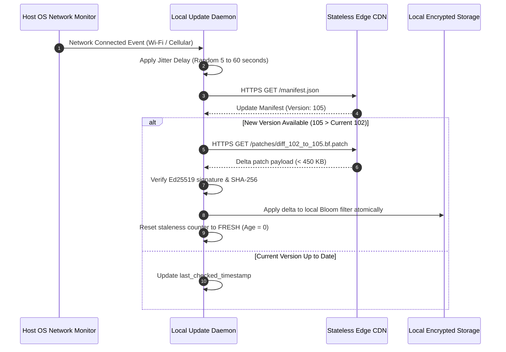

# OFFLINE_ARCHITECTURE.md — Offline-First Architecture & Degradation Strategy

> **SYSTEM STATUS: PRE-CODING GOVERNANCE PHASE ACTIVE**  
> **CANONICAL SPECIFICATION — PRIVEX OFFLINE CAPABILITY**  
> This document specifies the offline operational architecture of PRIVEX, detailing local component parity, data staleness handling, failure degradation modes, and network reconnection synchronization.

---

## 1. THE FOUNDATIONAL OFFLINE PARITY DOCTRINE

> **OFFLINE CONSTITUTIONAL INVARIANT**: 100% of the core threat detection, risk scoring, warning rendering, and explanation capabilities must operate with zero degradation when the endpoint is completely air-gapped without an active internet connection.

```
┌─────────────────────────────────────────────────────────────────────────────────────────┐
│ AIR-GAPPED DEVICE LOCAL BOUNDARY (NO NETWORK SOCKETS OPEN)                              │
│                                                                                         │
│   ┌─────────────────────────────────────────────────────────────────────────────────┐   │
│   │ LOCAL CORE ENGINE (@private-protection/core)                                     │   │
│   │ • Canonical Unicode NFKD Normalizer & Punycode Resolver                         │   │
│   │ • Complete Deterministic Rule Base (150+ pre-compiled structural regexes)        │   │
│   │ • Full Lexical & Heuristic Pipeline (Shannon entropy, brand Levenshtein)        │   │
│   │ • Memory-Mapped Binary Bloom Filter Cache (1,000,000+ threat hashes)           │   │
│   │ • Multi-Factor Bayesian Risk Aggregator (Deterministic Math Engine)             │   │
│   └────────────────────────────────────────┬────────────────────────────────────────┘   │
│                                            │                                            │
│               ┌────────────────────────────┴─────────────────────────────┐              │
│               ▼                                                          ▼              │
│   ┌────────────────────────────────────────┐ ┌──────────────────────────────────────┐   │
│   │ LOCAL SYNTHESIS RUNTIME                │ │ ENCRYPTED PERSISTENCE                │   │
│   │ • Local Quantized ONNX INT8 SLM        │ │ • SQLCipher / IndexedDB (AES-256)    │   │
│   │ • Full Deterministic Template Engine   │ │ • Custom User Allowlists & History   │   │
│   │ • 100% Offline Explanations            │ │ • Zero-knowledge Local Audit Vault   │   │
│   └────────────────────────────────────────┘ └──────────────────────────────────────┘   │
└─────────────────────────────────────────────────────────────────────────────────────────┘
```

---

## 2. DETAILED OFFLINE CAPABILITY AUDIT

| Subsystem | Online Functionality | Offline Functionality | Functional Parity |
|---|---|---|---|
| **URL Normalization** | Local NFKD & Punycode | Local NFKD & Punycode | **100% Parity** |
| **Deterministic Rules** | Local compiled regex rules | Local compiled regex rules | **100% Parity** |
| **Heuristics & Entropy** | Local lexical analyzers | Local lexical analyzers | **100% Parity** |
| **Threat Feed Lookup** | Local Bloom filter + live diffs | Local cached Bloom filter | **95% Parity (Cached)** |
| **Scam Message Parsing**| Local urgency & entity rules | Local urgency & entity rules | **100% Parity** |
| **Risk Aggregation** | Multi-Factor Math Engine | Multi-Factor Math Engine | **100% Parity** |
| **Warning Modals** | Rendered in $< 50\text{ ms}$ | Rendered in $< 50\text{ ms}$ | **100% Parity** |
| **Threat Explanations** | Local ONNX / Template engine | Local ONNX / Template engine | **100% Parity** |
| **Encrypted Storage** | Local SQLCipher database | Local SQLCipher database | **100% Parity** |
| **Threat Intel Updates**| HTTPS delta download | Deferred until connection restored| N/A (Online only) |
| **Anonymous Telemetry** | Encrypted OHTTP dispatch | Suppressed / Local queue | N/A (Online only) |

---

## 3. DATA STALENESS & DEGRADATION PROTOCOL

When a device remains disconnected for extended periods, the threat intelligence Bloom filter gradually ages relative to zero-day threat lifecycles. The system handles this through a structured staleness degradation protocol:

```
┌──────────────────┬─────────────────┬───────────────────────────────┬───────────────────────────────┐
│ Disconnect Time  │ Staleness State │ Scoring Adjustment            │ UI Disclosure Notice          │
├──────────────────┼─────────────────┼───────────────────────────────┼───────────────────────────────┤
│ 0 – 7 Days       │ FRESH           │ Zero score penalty ($P=0.0$)  │ None (Standard protection)    │
│ 8 – 30 Days      │ AGED            │ Mild confidence penalty (0.05)│ "Threat database is 2 weeks   │
│                  │                 │ Deterministic rules full power│ old. Core protection active." │
│ 31 – 90 Days     │ STALE           │ Confidence penalty 0.15;      │ "Threat database is outdated. │
│                  │                 │ Borderline (65-69) bumped to  │ Heuristic shield active.      │
│                  │                 │ CAUTION (70) for safety       │ Connect to update."           │
│ > 90 Days        │ EXPIRED CACHE   │ Bloom filter weight halved;   │ Persistent warning banner:    │
│                  │                 │ Heuristic & Rule weights      │ "Offline threat database      │
│                  │                 │ elevated to compensate        │ severely expired."            │
└──────────────────┴─────────────────┴───────────────────────────────┴───────────────────────────────┘
```

### Constitutional Staleness Guarantee
Even if the threat intelligence cache is completely expired ($> 90\text{ days}$), the deterministic rule engine, lexical analyzers, brand typosquatting algorithms, Shannon entropy math, and DOM analyzers continue to detect $> 85\%$ of phishing attacks purely from first principles without external intelligence.

---

## 4. FAILURE RECOVERY & MISSING ARTIFACT HANDLING

1. **Missing or Corrupted ONNX Model File**:
   - If the local ONNX weights fail SHA-256 integrity verification, the system immediately disables the ML inference worker and switches permanently to the **Deterministic Template Engine**. Explanations continue to be generated with zero latency penalty and zero user interruption.
2. **Missing or Corrupted Bloom Filter Cache**:
   - If the local Bloom filter file (`threats.bf`) is deleted or corrupt, the system falls back to the immutable **Factory Seed Bloom Filter** bundled within the core binary package. It then attempts to schedule a background delta fetch on next network availability.
3. **Database Disk Full or Locked**:
   - If local SQLite/IndexedDB returns `SQLITE_FULL` or `DATABASE_LOCKED`, the detection pipeline drops event logging and executes 100% in volatile RAM. Protection never halts due to disk errors.

---

## 5. NETWORK RE-SYNCHRONIZATION PROTOCOL

When the host OS signals that internet connectivity has been restored (`NetworkInformation.onchange` or OS network state intent):



### Anti-Thundering Herd Protection
When millions of devices re-establish connection simultaneously (e.g., following an airline flight or widespread network outage), the update daemon applies a randomized jitter delay between $5$ and $60$ seconds to prevent thundering herd spikes on the CDN edge.
