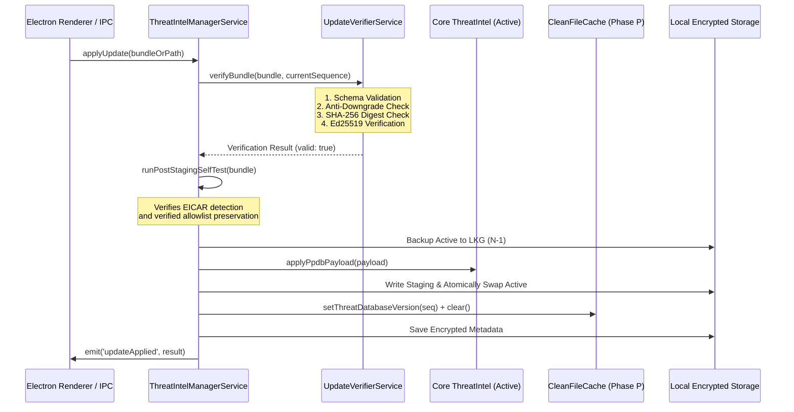

# Phase O Architecture — Threat Intelligence & Cryptographically Signed Updates

## 1. Executive Summary & Constitutional Alignment

Phase O delivers the production-grade, local-first, offline-first threat intelligence update subsystem for the **Private Protection** Windows Desktop Antivirus. It enables secure, air-gapped importation and over-the-air (OTA) ingestion of cryptographically signed `.ppdb` (Private Protection Database) threat definition bundles without ever transmitting user data, files, URLs, or browsing history off-device.

### Core Guarantees:
1. **Pinned Ed25519 Trust Anchor:** Updates are signed with pure Ed25519 signatures and verified strictly against a compiled-in production Root Public Key (`PRODUCTION_ROOT_PUBLIC_KEY`).
2. **Canonical Signed Message Construction:** Deterministic, unambiguous byte representation `${manifest.version}:${manifest.versionSequence}:${manifest.publishedAt}:${manifest.sha256}`.
3. **Monotonic Anti-Downgrade Enforcement:** Strictly prevents replay or downgrade attacks (`incoming.versionSequence <= currentVersionSequence` is rejected with `ANTI_DOWNGRADE_REJECT`).
4. **Digest Integrity Verification:** Exact byte-for-byte SHA-256 match between bundle payload and manifest digest (`HASH_MISMATCH` rejection).
5. **Deterministic Post-Staging EICAR Self-Test:** Update payloads are staged into an isolated in-memory trial engine and verified against the standard EICAR test signature and verified allowlists before active swap (`SELF_TEST_FAILED`).
6. **Crash-Safe Atomic Swap:** Staging $\rightarrow$ atomic disk swap $\rightarrow$ active engine hot-swap with zero downtime.
7. **3-Tier Storage Hierarchy:** `ACTIVE` $\rightarrow$ `LAST-KNOWN-GOOD (LKG N-1)` $\rightarrow$ `FACTORY SEED`.
8. **Phase P CleanFileCache Integration:** Automatic cache invalidation upon any database sequence or version change to prevent stale clean verdicts.
9. **Zero-Knowledge & 100% Offline Parity:** Operates completely air-gapped with zero remote telemetry or cloud dependencies.

---

## 2. Cryptographic Protocol & `.ppdb` Bundle Specification

### 2.1 File Format Specification (`PPDB1`)
A valid `.ppdb` file is an authenticated JSON container declaring format `PPDB1`:

```json
{
  "format": "PPDB1",
  "manifest": {
    "version": "2026.11.01",
    "versionSequence": 1001,
    "publishedAt": 1762000000000,
    "sha256": "4f53cda18c2baa0c0354bb5f9a3ecbe5ed12ab4d8e11ba873c2f11161202b945",
    "signature": "3b2c...128 hex chars...a4f1"
  },
  "payload": {
    "maliciousHashes": [
      {
        "hash": "e3b0c44298fc1c149afbf4c8996fb92427ae41e4649b934ca495991b7852b855",
        "threatName": "Trojan.Win32.Generic",
        "severity": "critical",
        "category": "MALWARE",
        "isCritical": true
      }
    ],
    "removeMaliciousHashes": [],
    "maliciousUrls": [],
    "removeMaliciousUrls": [],
    "maliciousIps": [],
    "removeMaliciousIps": [],
    "maliciousDomains": [],
    "removeMaliciousDomains": [],
    "metadata": {
      "description": "Weekly security definition release",
      "minEngineVersion": "1.0.0",
      "totalRules": 150000
    }
  }
}
```

### 2.2 Canonical Signed Message Construction
The Ed25519 signature in `manifest.signature` is computed strictly over:
$$\text{CanonicalMessage} = \text{manifest.version} \mathbin{\Vert} \text{":"} \mathbin{\Vert} \text{manifest.versionSequence} \mathbin{\Vert} \text{":"} \mathbin{\Vert} \text{manifest.publishedAt} \mathbin{\Vert} \text{":"} \mathbin{\Vert} \text{manifest.sha256}$$

---

## 3. Threat Intelligence Update Execution Pipeline



---

## 4. Anti-Downgrade & Replay Defense Matrix

| Attack Vector | Defense Mechanism | Error Code | System State |
|---|---|---|---|
| Replay of previous `.ppdb` update | `incoming.versionSequence <= currentVersionSequence` | `ANTI_DOWNGRADE_REJECT` | Active DB untouched |
| Forged or tampered signature | Ed25519 signature verification against pinned Root Public Key | `SIGNATURE_INVALID` | Active DB untouched |
| Tampered payload bytes | `SHA256(payload) != manifest.sha256` | `HASH_MISMATCH` | Active DB untouched |
| Future timestamp spoofing | Clock drift check ($> 5\text{ min}$ in future) | `TIMESTAMP_INVALID` | Active DB untouched |
| Prototype pollution in payload | `__proto__`, `constructor`, `prototype` rejection | `SECURITY_VIOLATION` | Active DB untouched |
| Broken update dropping EICAR | Post-staging trial engine self-test | `SELF_TEST_FAILED` | Active DB untouched |
| Path traversal in import path | `IpcValidator.validateUpdateBundlePath()` | `SECURITY_VIOLATION` | Rejected at IPC layer |

---

## 5. Storage Hierarchy & Last-Known-Good (LKG) Rollback

The system maintains a 3-tier storage hierarchy:
1. **Tier 1 (Active):** `threat-db.active.enc` — Authenticated AES-256-GCM encrypted active database state.
2. **Tier 2 (LKG N-1):** `threat-db.lkg.enc` — Previous known good database snapshot created immediately prior to update staging.
3. **Tier 3 (Factory Seed):** In-memory immutable compiled seed (`1.0.0-seed`, Sequence `100`) containing foundational EICAR test signatures and verified synthetic heuristics.

### Rollback Lifecycle:
- `rollbackToLastKnownGood()` decrypts and tests `threat-db.lkg.enc`.
- Validates EICAR detection in trial engine.
- Restores active ThreatIntel singleton state and atomically overwrites active DB.
- Invalidates `CleanFileCache` so all cached scan verdicts are purged.
- Emits `updateRollback` event across IPC.
- If LKG is missing or corrupted, fails safely with `LKG_RESTORE_FAILED` while retaining active DB, with optional explicit fallback to `resetToFactorySeed()`.
