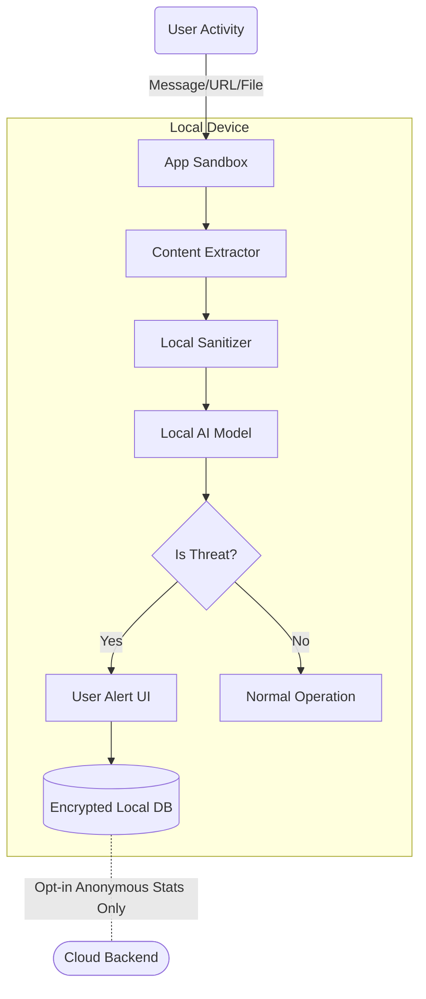

# Privacy Architecture: PRIVEX

## 1. Overview
PRIVEX is designed as a **privacy-first, on-device AI security assistant**. The core philosophy is that user data, especially sensitive content like personal messages, browsing history, and files, must remain under the user's control and ideally never leave the device.

## 2. Data Classification
To ensure appropriate handling, all data processed by the system is classified into three tiers:

- **Strictly Sensitive (Tier 1):** User messages, URLs visited, raw file contents, screen captures, keystrokes, personal identifiers (PII).
- **Metadata (Tier 2):** Aggregate statistics, execution times, model confidence scores (without raw inputs), file hashes, generic categorization labels.
- **Non-Sensitive (Tier 3):** Application binaries, static ML models, rule definitions, public threat intelligence feeds.

## 3. On-Device Processing Boundaries
- **Inference Engine:** All AI inference for detecting malicious content (phishing, scams, malicious files) is performed **100% on-device** using quantized local models.
- **Content Parsing:** Text extraction, HTML parsing, and file decoding occur within an isolated local sandbox.
- **Strictly Sensitive Data (Tier 1) NEVER leaves the device** unless explicit, per-incident user consent is granted (e.g., submitting a false negative for human review).

## 4. Data Minimization Principles
When cloud communication is necessary (e.g., checking a URL against a live reputation database):
- **Anonymization:** Data is stripped of PII.
- **Hashing:** We use techniques like k-Anonymity and partial hashing (e.g., sending only the first 4 bytes of a SHA-256 hash to the backend, retrieving all matching malicious hashes, and doing the final comparison locally).
- **Batching:** Queries are batched to prevent timing correlation attacks.

## 5. Encryption
- **At-Rest:** All local storage (databases, cached threat intelligence, user settings) is encrypted using AES-256-GCM. The encryption keys are derived from the OS keychain/keystore.
- **In-Transit:** All network communications (updates, telemetry, cloud fallback) use TLS 1.3 with strict certificate pinning.

## 6. Local Storage Protection
- **Desktop/Mobile:** Leveraging OS-level secure storage (Windows DPAPI, macOS Keychain, iOS Secure Enclave, Android Keystore) to store cryptographic keys.
- **App Sandbox:** The application database resides in a restricted application sandbox, inaccessible to other non-privileged applications.

## 7. Telemetry Policy
- **Opt-in Only:** Telemetry is completely opt-in during onboarding.
- **Acceptable Telemetry:** App crash rates, model inference latency, generic threat detection counters (e.g., "Blocked 5 phishing sites today").
- **Unacceptable Telemetry:** The actual URLs visited, the text of messages scanned, specific file names.
- **Differential Privacy:** Applied to telemetry aggregates before submission.

## 8. Crash Report Sanitization
- Automated sanitization hooks intercept crash dumps.
- Memory regions containing Tier 1 data are explicitly zeroed out or excluded from minidumps before transmission to the crash reporting service.
- Stack traces are stripped of variable values.

## 9. Log Sanitization
- Logging frameworks are configured to drop any variables marked as `@Sensitive`.
- No Tier 1 data is ever written to disk in plaintext logs.
- Log rotation is aggressive (e.g., max 5MB, overwritten daily).

## 10. Data Retention and Deletion
- **Ephemeral Processing:** Tier 1 data is held in volatile memory only for the duration of the scan and then explicitly zeroed.
- **Local History:** If the user opts to keep a local history of blocked threats, it is auto-deleted after 30 days.
- **Right to Erasure:** A single "Clear All Data" button permanently wipes the local encrypted database and destroys the encryption keys.

## 11. User Consent Framework
- **Granular Permissions:** Users must explicitly grant permissions for specific capabilities (e.g., "Screen Scanning", "Browser Integration").
- **Just-in-Time Prompts:** If a feature requires elevated access, the prompt explains *why* the access is needed and *how* the data will be used.

## 12. Permission Model
- **Android:** Uses Accessibility Services (strictly for reading screen text, no remote control), Storage Access Framework.
- **iOS:** Network Extension (for on-device DNS/URL filtering), Safari Web Extension.
- **Desktop (Windows/macOS):** Runs as standard user. Background service for file scanning.
- **Browser Extension:** Requests `activeTab` instead of `<all_urls>` where possible. Broad host permissions are only requested if the user enables continuous background scanning.

## 13. Offline Behavior
- The core product is fully functional offline.
- Local models and cached threat intelligence rules handle 100% of detection capabilities when a network connection is unavailable.

## 14. Cloud Fallback Behavior
- If an input is highly suspicious but the local model has low confidence, the app may suggest a cloud scan.
- This requires **explicit, one-time user consent** via a prompt: *"This file looks suspicious but requires a deeper cloud scan. Do you want to upload it to our secure servers?"*
- Uploaded data is processed in a secure enclave in the cloud, immediately deleted after scanning, and not used for model training.

## 15. GDPR/CCPA Compliance
- **Data Controller:** The user controls their data on their device.
- **DSR (Data Subject Requests):** Since we do not store PII on our servers, DSRs are fulfilled locally via the "Clear All Data" feature.
- **Privacy Policy:** Transparently written, explicitly stating that we cannot see the user's data.

## 16. Data Flow Diagrams

### Core Scanning Flow (On-Device)

