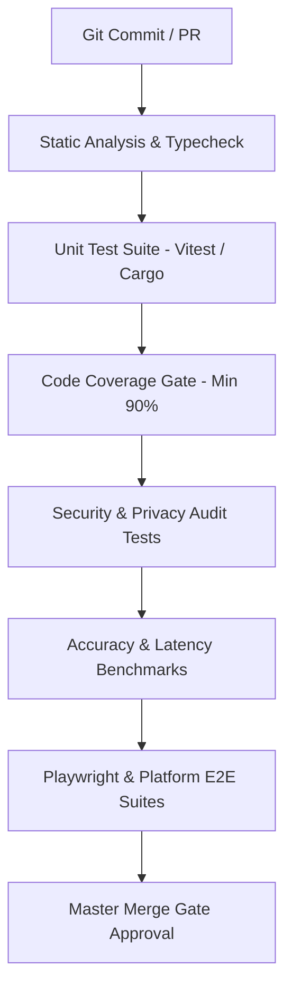

# Test Contract & Verification Strategy: PRIVATE PROTECTION

## 1. Overview & Verification Philosophy

PRIVATE PROTECTION mandates an uncompromising, multi-tier testing framework. No pull request or subagent handoff may be merged without meeting explicit verification contracts.

Every subsystem is verified across eleven distinct testing dimensions:

```
┌─────────────────────────────────────────────────────────────────────────────────┐
│                        ELEVEN SYSTEM VERIFICATION TIERS                         │
│                                                                                 │
│   1. UNIT TESTING          ➔ Pure functions, algorithms, parsers, & scorers     │
│   2. INTEGRATION TESTING   ➔ Multi-module pipeline & cross-package bridges       │
│   3. END-TO-END (E2E)      ➔ Real user flows across simulated OS & browser hosts │
│   4. SECURITY AUDITING     ➔ Fuzzing, memory bounds, IPC auth, & secret leaks   │
│   5. PRIVACY AUDITING      ➔ Network egress capture, memory zeroing verification │
│   6. PERFORMANCE TESTING   ➔ Automated latency budgets (p50/p95) & memory heaps  │
│   7. OFFLINE TESTING       ➔ Air-gapped network partition simulation             │
│   8. PLATFORM TESTING      ➔ Native OS extensions (Android, iOS, Win, macOS)     │
│   9. AI/ML EVALUATION      ➔ Precision, Recall, F1, calibration, & perplexity    │
│  10. ADVERSARIAL TESTING   ➔ Prompt injection, jailbreaks, Unicode evasions     │
│  11. REGRESSION TESTING    ➔ Alexa/Tranco top 1,000 false positive prevention   │
└─────────────────────────────────────────────────────────────────────────────────┘
```

---

## 2. Test Requirements by Subsystem

### 2.1 Shared Core Detection Engine (`packages/core`)
- **Required Test Tiers**: UNIT, INTEGRATION, SECURITY, PERFORMANCE, OFFLINE, REGRESSION.
- **Mandatory Gates**:
  - Statement, Line, and Branch Coverage $\ge 90\%$.
  - 100-sample benchmark accuracy $\ge 95\%$; False Positive Rate $\le 0.01\%$.
  - Execution latency: $p95 < 1.0\text{ms}$ on standard scan payloads.
  - Parser fuzzing: 10,000 malformed URL and text payloads with zero panics.
  - Alexa Top 1,000 false-positive regression: 0 legitimate sites blocked.

### 2.2 On-Device AI/ML Layer (`packages/ml`)
- **Required Test Tiers**: UNIT, INTEGRATION, AI/ML EVALUATION, ADVERSARIAL, PERFORMANCE.
- **Mandatory Gates**:
  - Model intent classification F1-score $\ge 0.92$ on validation dataset.
  - Adversarial prompt injection battery: 100+ injection variants; $100\%$ containment rate (zero overrides).
  - Inference latency: $p95 < 80\text{ms}$ (intent model); $p95 < 400\text{ms}$ (SLM first token).
  - Model memory allocation: $<50\text{MB}$ heap overhead.
  - Fallback verification: graceful fallback to template engine when model is missing or OOM.

### 2.3 Browser Extension (`apps/extension`)
- **Required Test Tiers**: INTEGRATION, END-TO-END, SECURITY, PLATFORM, PERFORMANCE.
- **Mandatory Gates**:
  - Playwright E2E browser automation suite on Chromium and Firefox.
  - Pre-navigation interception latency: $<50\text{ms}$ before page DOM render.
  - Shadow DOM CSS isolation test: verify extension styles do not leak to host page and vice-versa.
  - Content Security Policy (CSP) linter: zero `unsafe-inline` or `unsafe-eval`.
  - Offline operation test: intercept phishing URLs when browser is offline.

### 2.4 Mobile Application (`apps/mobile`)
- **Required Test Tiers**: UNIT, PLATFORM, SECURITY, PRIVACY, PERFORMANCE.
- **Mandatory Gates**:
  - Android Espresso / iOS XCUITest UI automation flows.
  - OS permission revocation tests: verify graceful degradation to on-demand scan mode when permissions are denied.
  - Memory footprint test: $<150\text{MB}$ active RAM; $<50\text{MB}$ background RAM.
  - Battery drain profiling: $<3\%$ battery impact over 24-hour simulation.
  - RAM zeroization audit: verify raw message buffer is scrubbed within $500\text{ms}$ of notification dismissal.

### 2.5 Desktop Security Software (`apps/desktop`)
- **Required Test Tiers**: INTEGRATION, END-TO-END, SECURITY, PLATFORM, PERFORMANCE.
- **Mandatory Gates**:
  - Cargo test suite for Tauri Rust background commands.
  - File quarantine round-trip test (EICAR standard test file).
  - Named Pipe / IPC security authorization test: verify unauthenticated processes are rejected.
  - CPU usage test: $<1.0\%$ idle; $<5.0\%$ during active folder monitoring.

### 2.6 Web Application Dashboard (`apps/web`)
- **Required Test Tiers**: END-TO-END, PERFORMANCE, PRIVACY, ACCESSIBILITY.
- **Mandatory Gates**:
  - Cypress / Playwright E2E tests for manual scan workflows.
  - Core Web Vitals: LCP $<2.0\text{s}$, FID $<100\text{ms}$, CLS $<0.1$.
  - WCAG 2.1 AA accessibility compliance audit (contrast ratio $\ge 4.5:1$, full keyboard navigation).
  - Client-side WASM execution verification: assert zero payload bytes sent to web server.

### 2.7 Optional Backend Services (`apps/backend`)
- **Required Test Tiers**: INTEGRATION, SECURITY, PRIVACY, PERFORMANCE.
- **Mandatory Gates**:
  - API schema conformance tests against OpenAPI v3 specifications.
  - Ed25519 update manifest signature verification test.
  - High-throughput load test: 1,000 req/sec sustained with $<50\text{ms}$ edge latency.
  - Privacy audit: verify zero IP addresses or persistent identifiers are persisted in backend logs.

---

## 3. Automated CI/CD Test Pipeline Execution Sequence


