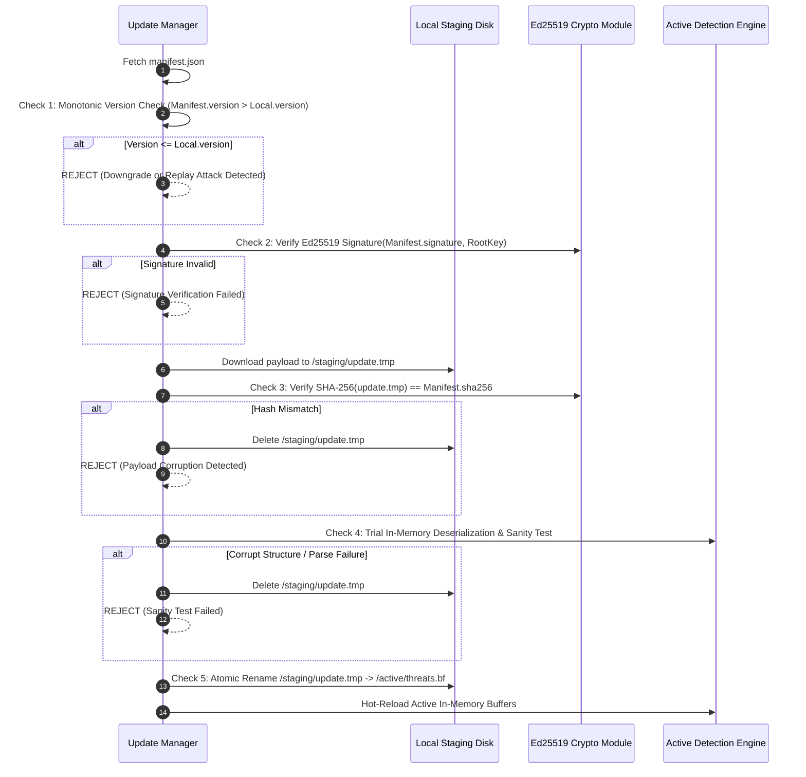

# UPDATE_SECURITY_ARCHITECTURE.md — Cryptographic Verification, Anti-Downgrade & OTA Updates

> **SYSTEM STATUS: PRE-CODING GOVERNANCE PHASE ACTIVE**  
> **CANONICAL SPECIFICATION — PRIVATE PROTECTION UPDATE SECURITY**  
> This document specifies the cryptographic update pipeline, air-gapped signing authority, monotonic versioning, atomic staging, and anti-downgrade protections governing all OTA differential updates.

---

## 1. THE THREAT MODEL FOR OTA UPDATES

Software update channels represent a tier-1 critical attack vector. A compromised update channel could allow an adversary to disable detection rules, push trojaned model weights, or compromise user endpoints. PRIVATE PROTECTION mitigates this with a zero-trust update architecture:

```
┌────────────────────────────────────────────────────────────────────────────────────────────────────────┐
│ AIR-GAPPED OFFLINE BUILD ENVIRONMENT (HARDWARE SECURITY MODULE / YUBIKEY)                              │
│                                                                                                        │
│   ┌───────────────────────────┐      SHA-256 Digest      ┌─────────────────────────────────────────┐   │
│   │ New Artifact (Bloom Filter│─────────────────────────►│ Ed25519 Hardware Signing Token (HSM)    │   │
│   │ Ruleset, Model Weights)   │                          │ • Private Key NEVER touches disk or net │   │
│   └───────────────────────────┘                          └────────────────────┬────────────────────┘   │
│                                                                               │                        │
│                                                        Ed25519 Signature      ▼                        │
│                                                   ┌─────────────────────────────────────────┐          │
│                                                   │ Signed Update Manifest                  │          │
│                                                   │ { version, sha256, signature, patchUrl }│          │
│                                                   └────────────────────┬────────────────────┘          │
└────────────────────────────────────────────────────────────────────────┼───────────────────────────────┘
                                                                         │
                                                                         ▼ HTTPS Upload
┌────────────────────────────────────────────────────────────────────────────────────────────────────────┐
│ UNTRUSTED PUBLIC DISTRIBUTION (CLOUDFLARE / FASTLY / S3 EDGE CDN)                                      │
│ ASSUMPTION: CDN CAN BE FULLY COMPROMISED BY ADVERSARY • CLIENTS TRUST ZERO CDN CONTENT BLINDLY         │
└────────────────────────────────────────┬───────────────────────────────────────────────────────────────┘
                                         │
                                         ▼ HTTPS GET (Static Manifest + Delta Patch)
┌────────────────────────────────────────────────────────────────────────────────────────────────────────┐
│ LOCAL ENDPOINT VERIFICATION PIPELINE                                                                   │
│                                                                                                        │
│   ┌────────────────────────────────────────────────────────────────────────────────────────────────┐   │
│   │ STEP 1: Monotonic Anti-Downgrade Check (Reject if Version <= CurrentInstalledVersion)           │   │
│   └────────────────────────────────────────┬───────────────────────────────────────────────────────┘   │
│                                            │ (Pass)                                                    │
│                                            ▼                                                           │
│   ┌────────────────────────────────────────────────────────────────────────────────────────────────┐   │
│   │ STEP 2: Ed25519 Cryptographic Signature Verification against Hardcoded Root Public Key         │   │
│   └────────────────────────────────────────┬───────────────────────────────────────────────────────┘   │
│                                            │ (Pass)                                                    │
│                                            ▼                                                           │
│   ┌────────────────────────────────────────────────────────────────────────────────────────────────┐   │
│   │ STEP 3: Atomic Staging & SHA-256 Payload Hash Verification                                      │   │
│   └────────────────────────────────────────┬───────────────────────────────────────────────────────┘   │
│                                            │ (Pass)                                                    │
│                                            ▼                                                           │
│   ┌────────────────────────────────────────────────────────────────────────────────────────────────┐   │
│   │ STEP 4: In-Memory Trial Execution & Schema Validation (Catch corruption before activation)     │   │
│   └────────────────────────────────────────┬───────────────────────────────────────────────────────┘   │
│                                            │ (Pass)                                                    │
│                                            ▼                                                           │
│   ┌────────────────────────────────────────────────────────────────────────────────────────────────┐   │
│   │ STEP 5: Atomic Directory Rename / Symlink Swap (Zero-Downtime Live Activation)                  │   │
│   └────────────────────────────────────────────────────────────────────────────────────────────────┘   │
└────────────────────────────────────────────────────────────────────────────────────────────────────────┘
```

---

## 2. CRYPTOGRAPHIC PRIMITIVES & ROOT KEY HIERARCHY

- **Signature Algorithm**: **Ed25519 (RFC 8032)**. Provides fast, constant-time verification with 128-bit security level, resistant to side-channel and timing attacks.
- **Hash Function**: **SHA-256 (FIPS 180-4)**.
- **Root Public Key Distribution**: The Root Ed25519 Public Key is compiled directly into the binary of `@private-protection/core` as an immutable byte constant. It is never retrieved over the network.
- **Key Separation**:
  - *Root Key*: Held on air-gapped hardware security modules (HSM). Signs intermediate Release Authority keys.
  - *Threat Intel Signing Key*: Rotated annually; signs daily/weekly Bloom filter patches.
  - *Ruleset Signing Key*: Signs deterministic regex updates.

---

## 3. STRICT MANIFEST CONTRACT & SCHEMA

Every update is mediated by an authentic `manifest.json`:

```json
{
  "$schema": "https://json-schema.org/draft/2020-12/schema",
  "title": "UpdateManifest",
  "type": "object",
  "required": ["version", "targetArtifact", "sha256", "signature", "minEngineVersion", "timestampEpoch"],
  "properties": {
    "version": {
      "type": "integer",
      "minimum": 1,
      "description": "Strictly monotonic integer. Must exceed current installed version."
    },
    "targetArtifact": {
      "type": "string",
      "enum": ["BLOOM_FILTER", "DETECTION_RULES", "ONNX_MODEL", "WASM_CORE"]
    },
    "sha256": {
      "type": "string",
      "pattern": "^[a-f0-9]{64}$",
      "description": "Hexadecimal SHA-256 hash of the uncompressed target artifact."
    },
    "signature": {
      "type": "string",
      "pattern": "^[a-f0-9]{128}$",
      "description": "Hexadecimal Ed25519 signature over (version + ':' + targetArtifact + ':' + sha256)."
    },
    "minEngineVersion": {
      "type": "integer",
      "description": "Minimum core engine version capable of parsing this artifact."
    },
    "timestampEpoch": {
      "type": "integer",
      "description": "Unix epoch timestamp when this update was signed."
    },
    "deltaBaseVersion": {
      "type": "integer",
      "description": "If present, this patch is a bsdiff delta against this base version."
    },
    "patchUrl": {
      "type": "string",
      "format": "uri",
      "description": "Relative or absolute URL to download the patch payload."
    }
  },
  "additionalProperties": false
}
```

---

## 4. THE 5-STEP ATOMIC VERIFICATION WORKFLOW



---

## 5. ANTI-DOWNGRADE & REPLAY ATTACK MITIGATION

1. **Hardware-Enforced Monotonic Counter**:
   - The client stores the highest installed version number in local encrypted storage.
   - Any manifest specifying a version number $\le$ current stored version is **immediately rejected without downloading the patch**.
   - Attackers cannot force a client to roll back to a known vulnerable ruleset or outdated threat intelligence file.
2. **Timestamp Freshness Envelope**:
   - The manifest timestamp must be within 7 days of the local system clock. Manifests dated in the past or far future ($> 24\text{ hours}$) trigger a clock discrepancy alert and require explicit verification.

---

## 6. CORRUPT PATCH RECOVERY & FACTORY SEED FALLBACK

1. **Zero Downtime Staging**:
   - Updates are downloaded, uncompressed, and validated in an isolated staging directory (`.tmp`).
   - The live active database file is never touched until the new artifact passes 100% of cryptographic and structural checks.
2. **Immediate Rollback**:
   - If an atomic hot-reload causes an unexpected runtime fault, the engine immediately reverts to the previous known-good version (`threats.bf.bak`).
3. **Immutable Factory Seed**:
   - Every client bundle includes an immutable, read-only factory seed Bloom filter and ruleset embedded directly within the application binary. Even in the worst-case scenario of complete disk corruption, the application restores the factory seed and functions normally.
